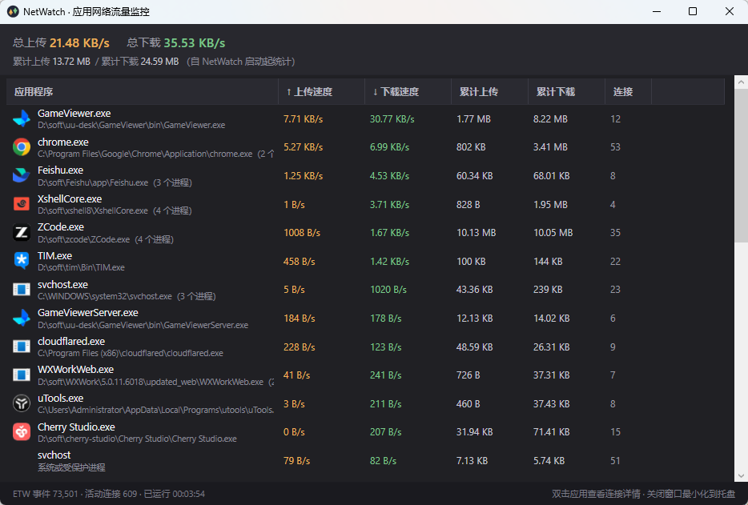

# NetWatch

> Windows 桌面应用：实时监控**每个应用程序**的上传 / 下载流量

  



## ✨ 功能

- **按应用统计**上传速度、下载速度、累计上传、累计下载，按流量自动排序，最活跃的应用置顶
- 同一应用的多个进程自动合并显示（如 Chrome、微信的多进程）
- **双击应用**查看它当前的所有 TCP/UDP 连接：本地 / 远程地址、连接状态、PID（每 2 秒自动刷新）
- 右键 → 打开文件位置
- 顶部实时显示整机上传 / 下载速率与累计总量
- 关闭窗口最小化到系统托盘，托盘提示实时显示整机速率
- 深色界面，支持高 DPI 与多显示器

## 🚀 快速开始

### 方式一：直接下载

从 [**Releases**](../../releases) 或 Actions 构建产物中下载 `NetWatch.exe`（单文件约 5.7 MB）。

> 需要安装 [.NET 8 桌面运行时](https://dotnet.microsoft.com/download/dotnet/8.0)。

### 方式二：从源码构建

```bash
git clone <本仓库地址>
cd NetWatch
dotnet run -c Release --project src/NetWatch.App
```

发布单文件 exe：

```bash
# 框架依赖版（约 5.7 MB，需目标机装有 .NET 8）
dotnet publish src/NetWatch.App -c Release -r win-x64 --self-contained false -p:PublishSingleFile=true -o publish

# 自包含版（约 150 MB，免装运行时）
dotnet publish src/NetWatch.App -c Release -r win-x64 --self-contained true -p:PublishSingleFile=true -o publish-selfcontained
```

## 🧰 命令行版

仓库同时附带一个无界面版本，便于脚本化验证：

```bash
netwatch-cli 20      # 监控 20 秒，每 2 秒打印一次有流量的进程
netwatch-cli --events # 列出内核网络事件（诊断用）
```

输出示例：

```text
── 10:03:52  整机 ↑9.88 KB/s  ↓4.96 MB/s   事件总数 4,925
   curl      PID 92768    ↑      0 B/s   ↓   4.91 MB/s
   GameViewer PID 69856    ↑   3.95 KB/s   ↓  43.72 KB/s
   chrome    PID 68256    ↑    275 B/s   ↓     948 B/s
```

## ⚙️ 运行要求

- Windows 10 / 11 / Server 2016+
- **以管理员身份运行**（读取内核网络事件需要管理员权限；程序已内置 UAC 提权清单，双击即弹出提权确认）

## 🔧 工作原理

```
内核 ETW 网络事件（每次 TCP/UDP 收发，含 PID + 字节数）
        │  Microsoft-Windows-Kernel-Network · NetworkTCPIP 关键字
        ▼
按 PID 累加字节数 ──► 每秒取增量算速率 ──► WPF 界面展示
        │
        └─► 连接列表：GetExtendedTcpTable / GetExtendedUdpTable（IP Helper API）
```

不安装驱动、不注入 DLL、不修改系统网络栈，全部使用 Windows 原生跟踪机制，关闭程序后不留任何残留。

## 📁 项目结构

```
NetWatch/
├── src/
│   ├── NetWatch.Core/   # 采集核心：ETW 按进程统计流量 + 连接枚举（P/Invoke）
│   ├── NetWatch.App/    # WPF 桌面界面
│   └── NetWatch.Cli/    # 命令行验证工具
├── docs/                # 截图等文档资源
└── .github/workflows/   # CI：Windows 构建并上传产物
```

## ⚠️ 已知限制

- 只统计 **NetWatch 启动之后** 的流量（Windows 不提供按进程的历史流量回溯）
- 回环（localhost）流量两侧都会计入
- 走 VPN / 代理的流量会归到代理进程名下（如 cloudflared），而非原始应用
- 与其他占用内核跟踪会话的工具（如 PerfView、Wireshark 内核捕获）互斥，同时只能开一个
- 日志位于 `%TEMP%\netwatch.log`

## 📄 许可证

[MIT](LICENSE)
